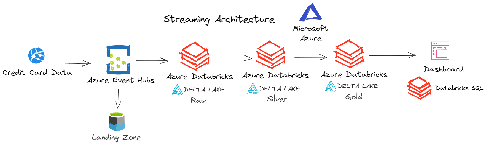

# Architecture

<div aling="center">
  
</div>

### Start Events - Prerequisites
1. Clone the repo
   ```
   git clone https://github.com/phillipefs/credit-card-streaming-analytics.git
   ```
2. Create .env file
   ```
   BATCH_QUANTITY=5
   BATCH_SIZE=100
   SLEEP_SECONDS=5
   CNN_STRING_EVENTHUB='Endpoint=sb:xxx'
   NAME_EVENTHUB="xxxxxxxxxxxxxxxxxxx"
   ```
3. Install requirements file
   ```
   pip install -r requirements.txt
   ```
4. Run app_events
   ```
   python .\app_events.py
   ```

### Databricks - Prerequisites 
1. Create cluster and install lib azure-eventhub. 
   ```
   com.microsoft.azure:azure-eventhubs-spark_2.12:2.3.22
   ```

### Databricks - Workflow Streaming
<div aling="center">
  
</div>


### Dashboard Streaming Analytics - Update Every Minute

<div aling="center">
  
</div>
